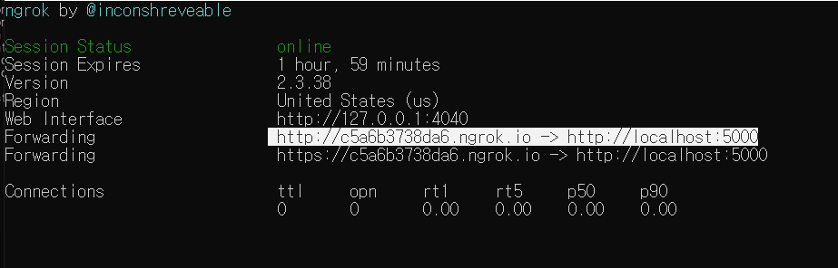
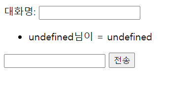

# JS를 이용한 Chat Project

## 🎨기술스택

* Nodejs (express)
* Socket.io
* Vanilla JS
* Flex
* ngrok 
  * 외부에서도 다른 사용자가1260 사용할 수 있도록 해줌


## ✍Process


## 📂파일구조

```
chat project
	ㄴ img
	ㄴ README.md
	ㄴ node_modules
	ㄴ src
		ㄴ css
		   ㄴ style.css
		ㄴ js
		   ㄴ chat.js
		ㄴ index.html
	ㄴ package.json
	ㄴ package-lock.json 
```

* img  : README의 image를 담고있음

* package-lock.json :  앱설정, 설치항목, 기능등이 담겨있음

  아래 명령어로 생성됨
  
  ```
  npm init -y
  ```


## 💿설치항목

| 개발언어 | 개발환경  | API & 라이브러리 |
| -------- | --------- | :--------------- |
| JS       | express   | moment           |
|          | Socket.io | nodemon          |
|          |           | ngrok            |

* nodemon : JS파일의 변경이 있을 때마다 자동으로 재실행 시켜줌

  * 실행방법

    ```
    nodemon app.js
    ```

* ngrok : 외부의 사람들이 내 포트로 접속할 수 있도록 만들어줌

  * 실행방법

    * node.js 실행 후

    ```
    ngrok http <포트번호>
    ```

    * Forwarding에 있는 주소 사용하면 외부에서도 내가 사용하는 포트로 접속가능

    


## 💡문제점과 해결방법

### 문제 1. 새로고침시 undefined발생



**해결방법. if문으로 해결**

```
//chat.js 파일

// 서버에서 데이터 받기
socket.on("chatting", (data) => {
    console.log(data) // {name, value}
    // chatList
    if (data.name === undefined || data.msg === undefined ) {
        console.log(data)
    }
    else {
        const li = document.createElement("li");
        li.innerText = `${data.name}님이 - ${data.msg}`
        chatList.appendChild(li)
    }
})
```

* 새로고침시 undefined가 뜨는 문제는 해결됐으나 내용이 사라지는 문제 발생


